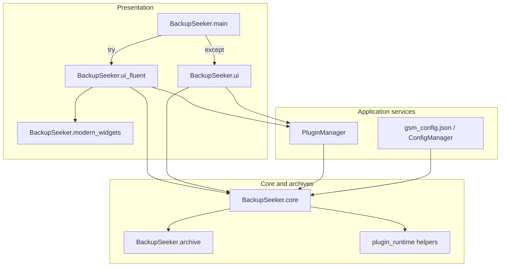

# BackupSeeker architecture

This document describes how the desktop app is structured at runtime and where backup/restore logic lives.

## Layers

- **Presentation:** [`BackupSeeker/main.py`](../BackupSeeker/main.py) imports `run_modern_fluent_app` from [`BackupSeeker/ui_fluent`](../BackupSeeker/ui_fluent/__init__.py) (implemented in [`app_runner.py`](../BackupSeeker/ui_fluent/app_runner.py), main window in [`main_window.py`](../BackupSeeker/ui_fluent/main_window.py), feature pages in `dashboard.py`, `profiles_page.py`, `plugins_page.py`, `backups_page.py`, etc.). Shared Fluent building blocks live in [`BackupSeeker/modern_widgets.py`](../BackupSeeker/modern_widgets.py). On any import or init failure, the core prints a traceback and falls back to [`BackupSeeker/ui.py`](../BackupSeeker/ui.py) (`run_app` / legacy `MainWindow`).
- **Application services:** [`BackupSeeker/plugin_manager.py`](../BackupSeeker/plugin_manager.py) discovers code plugins (`pkgutil` over `plugins/`) and JSONC plugins (`games.jsonc`), respects optional [`plugins/plugin_index.json`](../BackupSeeker/plugins/plugin_index.json), downloads/caches plugin icons and posters under `BackupSeeker/data/`, and registers [`GamePlugin`](../BackupSeeker/plugins/base.py) instances. Configuration is loaded/saved via core’s config types (path `BackupSeeker/gsm_config.json`).
- **Core:** [`BackupSeeker/core.py`](../BackupSeeker/core.py) holds `GameProfile`, path contraction/expansion, `run_backup`, restore flows, and orchestration with [`BackupSeeker/archive/`](../BackupSeeker/archive/) (bundle format, ZIP packaging, restore safety checks).
- **Fluent helpers:** [`BackupSeeker/fluent_window.py`](../BackupSeeker/fluent_window.py) defines protocols and helpers (for example toast parent resolution) so widgets avoid circular imports with the Fluent package.

## Startup sequence

1. `python -m BackupSeeker.main` runs the package entry (or `python -m BackupSeeker.ui_fluent` for the Fluent runner only).
2. Import `run_modern_fluent_app` from `BackupSeeker.ui_fluent` → [`app_runner.run_modern_fluent_app`](../BackupSeeker/ui_fluent/app_runner.py): `QApplication`, Fluent theme from config, then [`ModernBackupSeekerWindow`](../BackupSeeker/ui_fluent/main_window.py).
3. If Fluent import or init fails, print traceback and use `BackupSeeker.ui.run_app` instead.

## Backup pipeline (conceptual)

Both UIs follow the same pattern:

1. Resolve `GamePlugin` for the current profile (`plugin_id`).
2. `profile.as_operation_dict(plugin)` → optional `plugin.preprocess_backup(profile_dict)`; UI may push changed `save_path` back onto the profile.
3. **`run_backup(profile, config, plugin)`** in `core.py` — builds archive rows from plugin save layout, optional registry export, bundle body via `archive.bundle.build_bundle`, writes ZIP with `bundle.json`, README, embedded portable scripts/plugin copy, and file members.
4. Optional `plugin.postprocess_backup({"backup_path": ...})`.

Restore flows use the corresponding preprocess/postprocess restore hooks and Safety archive creation where implemented in the UI/core path.

## Plugins

Discovery and registration are centralized in **`PluginManager`**:

- **Code plugins:** Python files under `BackupSeeker/plugins/` exporting `get_plugins()` → list of `GamePlugin` instances (or templates using `auto_get_plugins()`).
- **Data plugins:** `BackupSeeker/plugins/games.jsonc` (comments stripped at load) converted via `plugin_from_json`.
- **Filtering:** Optional `plugin_index.json` with `modules` (allow list) and `disabled` (block list).

**`GamePlugin`** uses declarative **`save_sources`**: a list of dicts (`kind`: `directory` or `registry_windows`, optional prompts, pin paths, etc.). Derived APIs include `save_paths`, `save_locations`, and `registry_keys` (see [`plugins/save_sources.py`](../BackupSeeker/plugins/save_sources.py)). Bundle snapshots embed `save_sources` for portable restore.

Hooks and advanced behavior are documented in [PLUGIN_DEVELOPMENT.md](PLUGIN_DEVELOPMENT.md).

## Bundle and format versioning

Backup ZIPs embed a **`_backupseeker/bundle.json`** (and related layout) produced by the archive subsystem. Format evolution is centralized (see [`BackupSeeker/archive/format_registry.py`](../BackupSeeker/archive/format_registry.py) and [CONTRIBUTING.md](../CONTRIBUTING.md) backwards-compatibility notes).

To refresh tooling inside older backup ZIPs, use `scripts/upgrade_backup_zips.ps1` (runs `python -m BackupSeeker.archive.upgrade_zip`).

## Related documents

- [PRD.md](PRD.md) — product scope
- [PLUGIN_DEVELOPMENT.md](PLUGIN_DEVELOPMENT.md) — plugin API and examples
