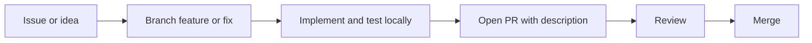

# Development workflow

Distilled from [CONTRIBUTING.md](../CONTRIBUTING.md). For full policy text (conduct, licensing, releases), read that file.

## Day-to-day



1. **Pick or file work** — Prefer labeled `good first issue` / `help wanted`; use `bug`, `enhancement`, `plugins`, `ui`, `docs` as appropriate.
2. **Branch** — `feature/<short-name>`, `fix/<issue-id>-<short>`, `docs/<short>`, `plugin/<game-id>`.
3. **Implement** — One logical change set per PR; avoid unrelated refactors.
4. **Test** — `python -m BackupSeeker.main` from a venv with [requirements.txt](../requirements.txt). Core logic: unit tests where they exist or add targeted tests for `core` behavior. UI: manual steps in the PR body (dialogs, theme, backup/restore path).
5. **PR** — Motivation, summary, UI screenshots/GIFs if UI changed; `Closes #id` when applicable; confirm docs updated.

## Environment (Windows example)

```pwsh
python -m venv .venv
.\.venv\Scripts\Activate.ps1
python -m pip install --upgrade pip
python -m pip install -r requirements.txt
python -m BackupSeeker.main
```

PyQt6, PyQt6-Fluent-Widgets, frameless-window helpers, and `requests` are already listed in `requirements.txt`. Re-run `pip install -r requirements.txt` after it changes.

Direct Fluent package entry (same Fluent path as `BackupSeeker.main` when Fluent loads successfully):

```pwsh
python -m BackupSeeker.ui_fluent
```

## Commits

- Imperative subject line (“Add backup retention option”).
- Body: what changed and why; reference issue IDs.

## Plugins

Follow [PLUGIN_DEVELOPMENT.md](PLUGIN_DEVELOPMENT.md) and [CONTRIBUTING.md](../CONTRIBUTING.md) (plugin contributions section): stable `game_id`, **`save_sources`** (or derived paths), PR test instructions for detection.

## Documentation

Canonical docs live under [Docs/](README.md). When behavior or entry points change, update **README**, **Docs/ARCHITECTURE**, or **PLUGIN_DEVELOPMENT** as appropriate.

## Related

- [CONTRIBUTING.md](../CONTRIBUTING.md) — full contributor guide
- [ARCHITECTURE.md](ARCHITECTURE.md) — system structure
